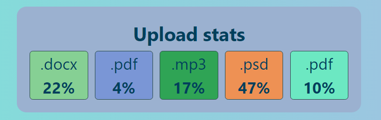
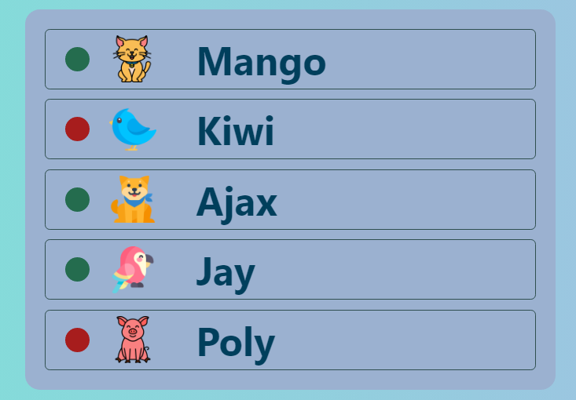
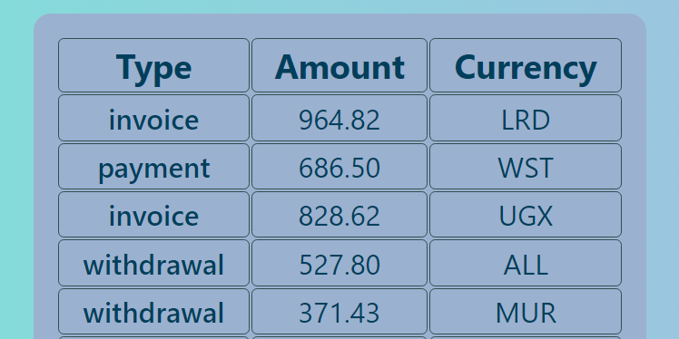

# React Homework - 1

Creating a user profile.

## The project used:

`«React»`
`«Javascript»`
`«Module CSS»`
`«prop-types / npm»`

## Project structure

`«Profile section»`

`«Statistics section»`

`«Friens section»`

`«Transaction history section»`

